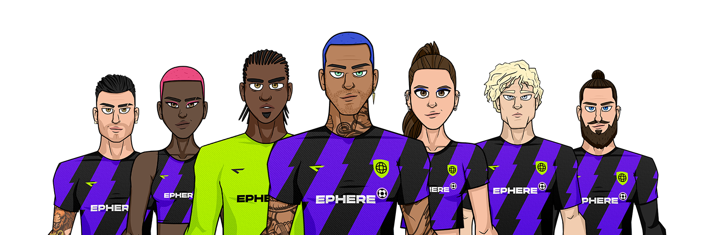

# Ephere (Translation in progress)

## Introducción

**Ephere** es un metaverso de juegos basados en fútbol donde las personas pueden para ganar criptomoneda haciéndolo bien en el juego y contribuyendo a su ecosistema. Consiste de dos componentes principales; El primero una colección escasa de jugadores de fútbol cuidadosamente diseñados y entregados en la forma de NFT. Encima de eso, hay un juego de simulación de gerencia futbolística que permite a las personas usar esos jugadores de fútbol en una divertida experiencia de juego play-to-earn.

**Los jugadores de fútbol** son parte esencial del universo. Los llamamos **Ephereals**, dada su naturaleza etérea pero a la vez realista. Tienen atributos mentales y físicos, habilidades de fútbol que se pueden entrenar, y una apariencia visual rica en detalles. Ganan experiencia al jugar partidos, y también se cansan, se lesionan, envejecen, y se retiran — _están vivos_.

**El juego** consiste en manejar tu propio equipo de fútbol, lo que incluye contratar jugadores (NFTs), escoger la alineación del equipo, la estrategia de juego, y manejar su infraestructura (instalaciones de entrenamiento, estadio, etc) para maximizar tus chances de ganar partidos, competiciones, completar desafíos y así ganar [$EPH](tokenomics/usdeph.md).
