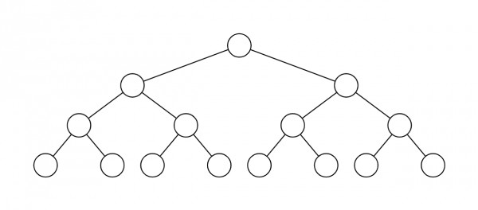

# Liga

Cuando te registres como nuevo usuario, se te asignará automáticamente a una liga con espacio libre. Cada liga consta de 16 equipos. Si ya no hay ligas disponibles, se creará una nueva liga. Las ligas siguen una estructura jerárquica:

Cada equipo juega contra otro equipo en la misma liga dos veces por temporada. Como hay 16 clubes por liga, juegas 30 partidos por temporada. Los partidos de liga se juegan una vez al día, por lo que una temporada durará alrededor de un mes.

Al final de la temporada, los 4 mejores equipos de cada liga ascenderán al siguiente nivel y recibirán recompensas de [$EPH](../economia/usdeph.md) según su posición. Asimismo, los 4 equipos más débiles de cada liga serán relegados a una liga con un nivel menor a la liga actual.
