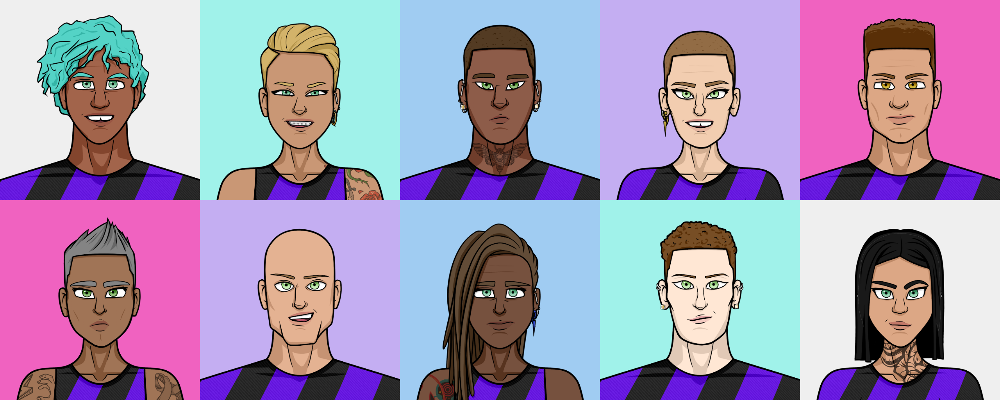

# Football player appearance

We want our users to _love_ their players, but it’s hard to love a faceless dataset. That’s why we crafted detail-rich visuals that complement the data model by giving it a curated visual appearance.

There are two ways of determining the visual appearance of an Ephereal. For most of them it’s by their genetic code, a number in the data model that determines different traits. Each trait corresponds to a different body part. Those parts are then combined to produce the final image. Between the many different traits **there are more than six billions of possible combinations**.

For some other very rare players (limited editions) the visual appearance will be crafted by our artists.

### Personalization

For those players with an algorithmically-generated visual appearance, owners will be able to add accessories such as tattoos, piercings, makeup, as well as styling their hair and customizing their kits.

### Inclusiveness

One of the things that distinguishes our project from all others (not only football-related) is that our representation of humans includes several underrepresented groups. Parading this kind of diversity makes us very proud, indeed!

We encourage you to help us send a message of inclusion, tolerance, and respect by letting us know if we missed any of them, and also by demanding your game/service providers to include them when representing humans.
