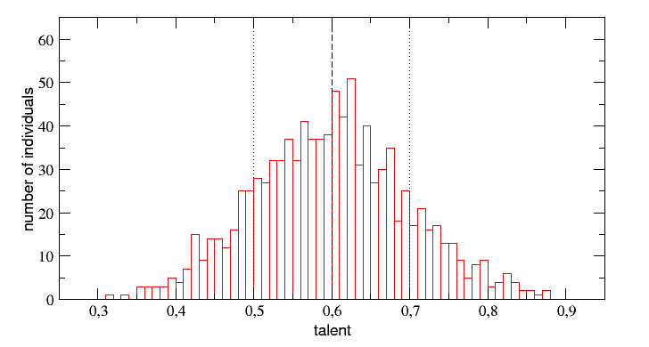

# Talent distribution

To have a competitive football universe in which the vast majority of teams can compete with some chance of success is important to manage how talent is distributed among the EFPs population. Too many talented EFPs and you end up with an unrealistic universe in which luck (random events) plays an insignificant role and the game ends up being boring. Too few talented EFPs (a too-homogeneous population) and you end up with an unrealistic universe in which there’s no way to differentiate your team regardless of how much effort you put into the game and again: luck plays an insignificant role and the game would result in a boring experience.

We believe that mother Nature has done a great job maintaining a proper [balance between the impact of talent and luck in success and failure](https://www.researchgate.net/publication/323302956\_Talent\_vs\_Luck\_the\_role\_of\_randomness\_in\_success\_and\_failure) so we inspired our talent distribution in the same way she did. When it comes to it, humans follow a Gaussian distribution:

In Ephere, players’ overall performance (the average of all the attributes) of the entire population will follow the aforementioned distribution. This means that most of the players will be average, a few will be bad, a few will be good, and only a handful of them will be superstars (After all, there’s only one Messi).
