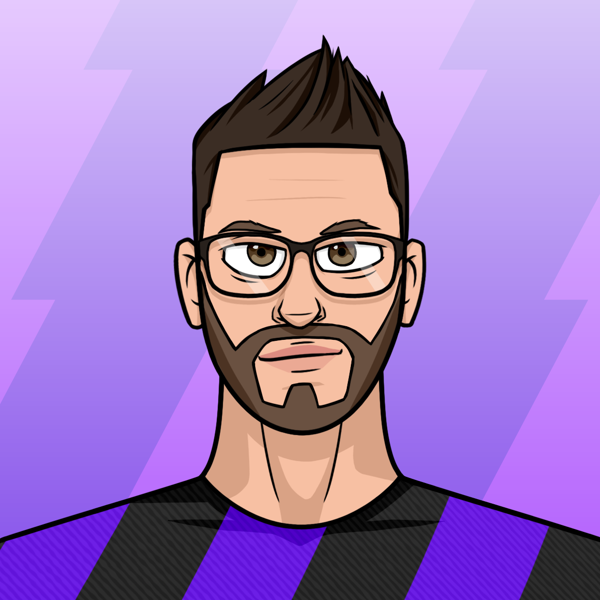
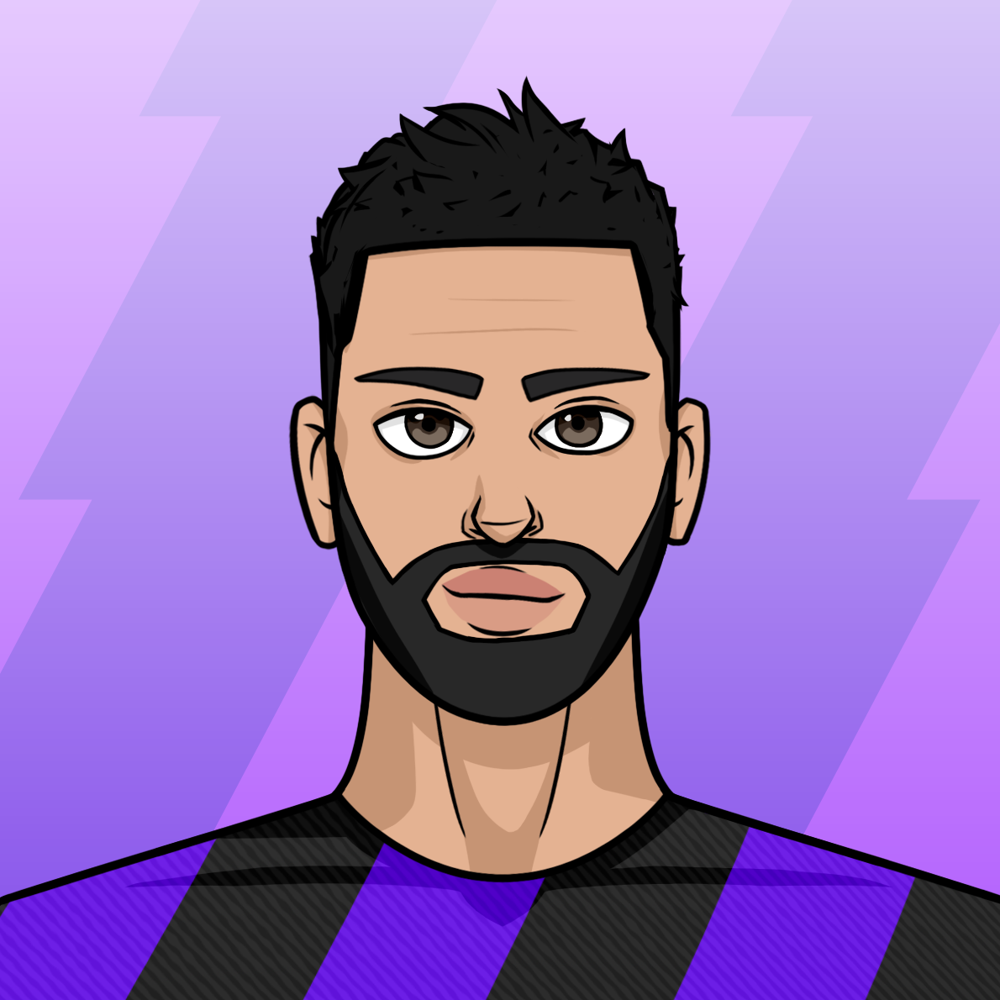
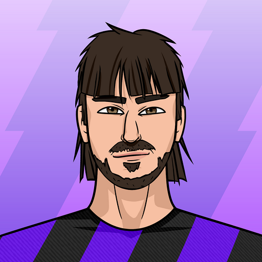
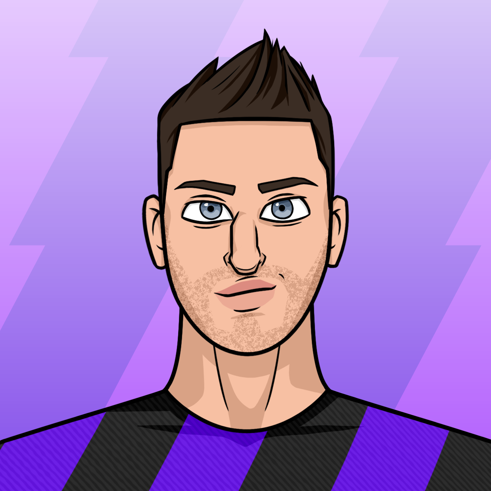
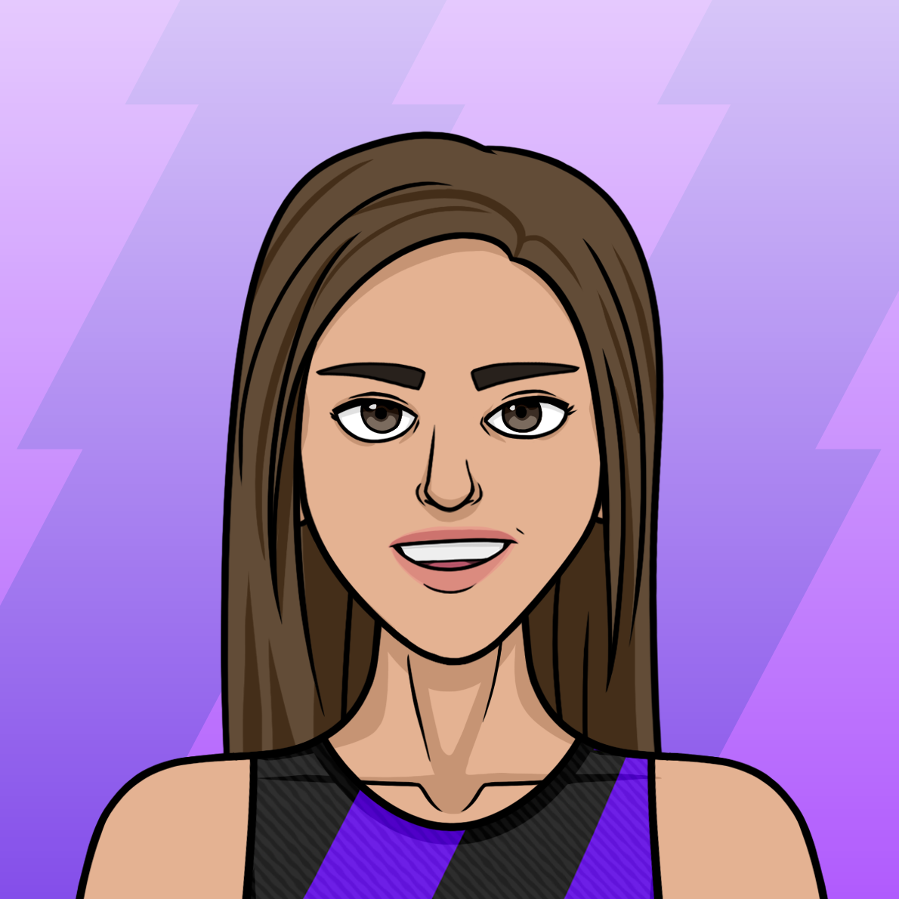
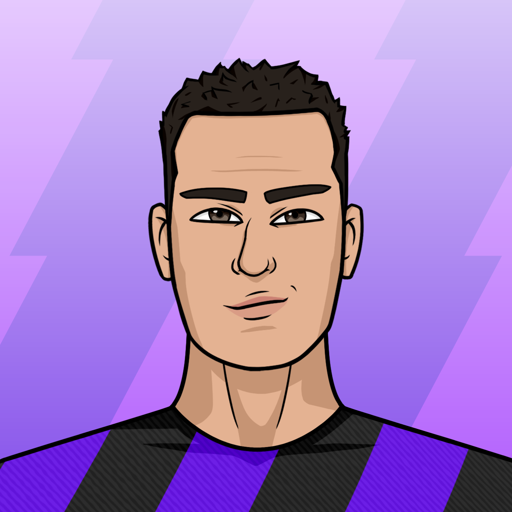

# Equipo

   .png>)      

#### [Agu](https://agu.uy)

I’m Agu, Founder & CEO of Ephere.

Imagino un mundo en el que las personas pueden trabajar haciendo lo que aman. Por eso estamos construyendo Ephere, un juego de fútbol donde las personas pueden jugar para ganar. Algunos datos divertidos sobre mí: me gusta el estoicismo, puedo pilotear aviones, suelo usar camisetas blancas o negras (aunque poco a poco estoy cambiando mi uniforme a una versión más colorida 😜), y voy a ir al espacio algún día.

#### [Héctor](https://www.linkedin.com/in/hectorituarte/)

Estoy a cargo del crecimiento de este increíble universo.

He sido tecnólogo desde que tengo memoria. Comencé a jugar videojuegos desde la primera vez que mis primos mayores me permitieron unirme a ellos en sesiones de días de Mario Bros durante las vacaciones. Una vez vendí un par de zapatillas Jordan para poder pagar una consola de SNES. Pero por mucho que lo intenté, nunca pude involucrarme en el desarrollo de videojuegos, hasta ahora.

#### [Felipe](https://www.linkedin.com/in/felipe-collazo-70028b92/)

Hey, soy Felipe, pero puedes decirme Yazo, Soy Co-Founder, Art Director y Director of Awesomeness en Ephere.&#x20;

Cuando no estoy detrás de mi escritorio creando Ephereals, posiblemente esté fuera andando en bicicleta, mirando Blade Runner por 92ª vez, o tratando de comunicarme con un gato que acabo de conocer al azar.

También soy tatuador así que llámame cuando estés listo para tatuarte tu Ephereal en un lado de tu cara.

#### [Keli](https://www.linkedin.com/in/ornella-porras-7178ba224/)

Hey! Soy Keli, Comunnity Manager Interna en Ephere. Estaré liderando nuestro staff de Discord y manejando redes sociales. Siempre quise ser una Ingeniera de Cohetes, y realmente, de cierta forma lo soy, porque siento que Ephere es un cohete que volará muy, muy alto. Y pondré todo de mí para hacer que eso suceda 🚀. Si hay algo que necesites, incluyendo jugar videojuegos, ¡contáctame!

#### [Ren](https://www.linkedin.com/in/renzodogliotti/)

Soy Ren, Sofware Engineer Intern en Ephere.

Llevo más de 10 años en informática, apasionado del mundo blockchain y en especial de los juegos NFT, es un sueño formar parte de este proyecto que va a cambiar vidas.

#### [Nico](https://www.linkedin.com/in/nicolas-agustin-rodriguez/)

Hola, soy Nicolás y soy full-stack Software Engineer en Ephere.

He sido adicto a la tecnología desde que era joven y disfruto mucho aprendiendo nuevas tecnologías todos los días. Hoy en día estoy obsesionado con blockchain y descentralización.

Papá de 2 hermosas niñas, e hincha de Defensores de Belgrano. Soy de Buenos Aires, Argentina.

#### [Rodri](https://www.linkedin.com/in/rodrigomelon/)

¡Hola! Soy Rodri y soy Software Engineer en Ephere, donde trabajo con un gran equipo creando cosas geniales.

Soy un gran fanático de Boca Juniors y del fútbol en general. Vivo en Buenos Aires y trato de ir al estadio cada vez que Boca juega en 'La Bombonera'. Es toda una experiencia.

También soy un amante del vino tinto, ¡así que puedes contactarme si tienes alguna recomendación!

#### [Santi](https://www.linkedin.com/in/santiago-rangel-mora-a71238191/)

Senior Software Engineer

#### [Andrea](https://www.linkedin.com/in/andrea-g-821901b0/)

Fundraiser

#### [Iván](https://www.linkedin.com/in/ivanarced/)

Fundraiser
