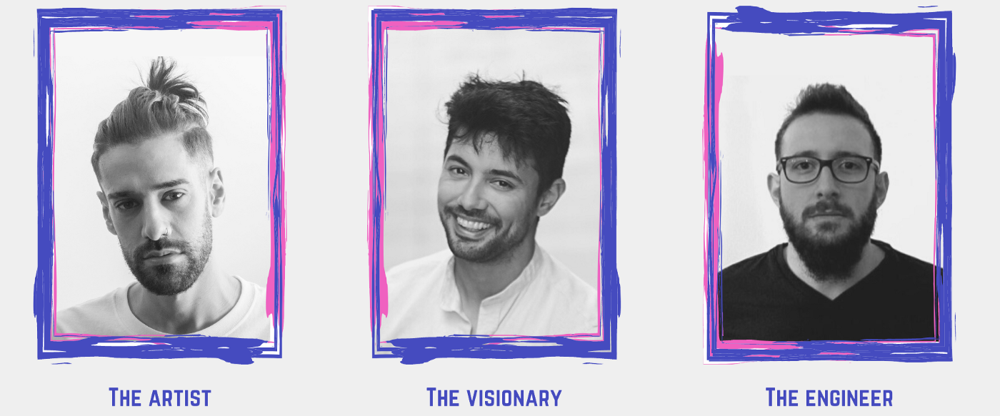

# Team

Ephere is headed up by three guys that were born in [a land that lives, breathes, and vibrates with football](https://www.guruguay.com/uruguay-national-soccer-squad/). The artist, [Felipe Collazo](https://www.linkedin.com/in/felipe-collazo-70028b92/) is an experienced illustrator and designer who graduated from the Maryland Institute College of Art. The engineer, [Nicolás Fernández](https://torre.co/en/nicolasfernandez) has been crafting software for world-class companies (Including Etermax, the company behind Trivia Crack) for the past ten years. Along these two, [myself](https://agu.uy). I’ve played football the first half of my life and engineered software the other half.

